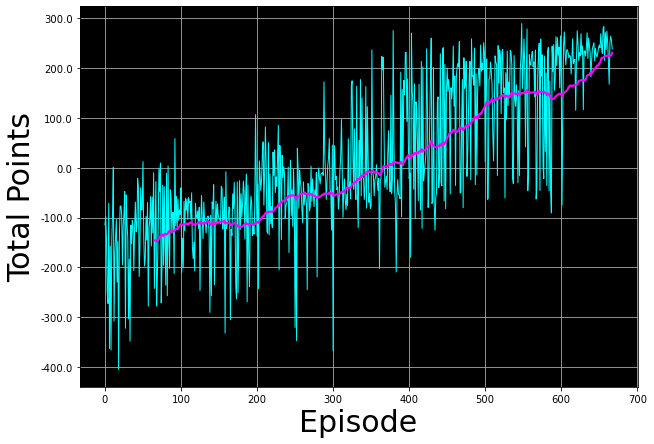

# Lunar Lander AI using Deep Q-Learning & OpenAI Gym

This repository contains the implementation of a Deep Q-Learning agent to solve the Lunar Lander environment from OpenAI Gym.

## Table of Contents

- [Introduction](#introduction)
- [Getting Started](#getting-started)
- [Requirements](#requirements)
- [Usage](#usage)
- [Results](#results)
- [Episode vs Total Points](#episode-vs-total-points)
- [Demo](#demo)

## Introduction

The Lunar Lander environment is a classic reinforcement learning problem where the objective is to safely land a spacecraft on the moon's surface. In this project, we use Deep Q-Learning to train an agent that learns optimal actions for successful landings.

## Getting Started

Follow these steps to get started with this project:

1. Clone the repository:

    ```bash
    git clone https://github.com/amerob/lunar-lander-RL-DeepQ.git
    cd lunar-lander-RL-DeepQ
    ```

2. Install the required dependencies. You can use a virtual environment if desired:

    ```bash
    pip3 install -r requirements.txt
    ```

## Requirements

- Python 3.7+
- OpenAI Gym
- NumPy
- TensorFlow (or compatible version)
- Other required libraries specified in `requirements.txt`

## Usage

1. Open `Lunar_Lander` using Jupyter Notebook.
2. Run the notebook cells to train the Deep Q-Learning agent and observe its performance in the Lunar Lander environment.

## Results

The trained agent demonstrates successful landings in the Lunar Lander environment. You can view a video of the agent's performance in the `videos` directory.

## Episode vs Total Points

To track the agent's performance during training, we plot the total points accumulated in each episode. The diagram below illustrates the relationship between episodes and the total points scored, providing insights into how the agent's performance improves over time.



This graph demonstrates how the agent's performance evolves as it learns, with total points gradually increasing as the agent masters the environment.

## Demo


