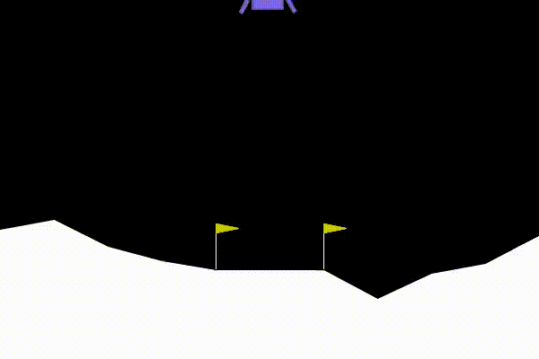

# Lunar Lander with Deep Q-Learning

This repository implements a Deep Q-Learning agent to solve the Lunar Lander environment from OpenAI Gym.

> 


## Table of Contents

- [Introduction](#introduction)
- [Getting Started](#getting-started)
- [Requirements](#requirements)
- [Usage](#usage)
- [Results](#results)
- [Episode vs Total Points](#episode-vs-total-points)

## Introduction

The goal is to train an agent to safely land a spacecraft on the moon using Deep Q-Learning.

## Getting Started

1. Clone the repository:

    ```bash
    git clone https://github.com/amerob/lunar-lander-RL-DeepQ.git
    cd lunar-lander-RL-DeepQ
    ```

2. Install dependencies:

    ```bash
    pip3 install -r requirements.txt
    ```

## Requirements

- Python 3.7+
- OpenAI Gym
- NumPy
- TensorFlow (or compatible version)
- Libraries in `requirements.txt`

## Usage

1. Open `Lunar_Lander` in Jupyter Notebook.
2. Run the cells to train the Deep Q-Learning agent and view its performance.

## Results

The trained agent successfully lands in the Lunar Lander environment. See the `Trained Agent` directory for a video.

## Episode vs Total Points

The graph below shows how the agent’s performance improves over time, with total points increasing as it masters the environment.


****
